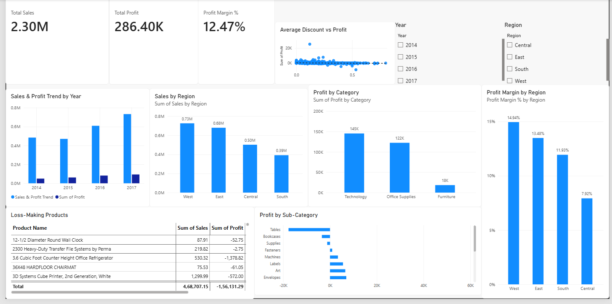

# E-Commerce Sales & Profit Analysis

## Project Overview

This project analyzes e-commerce sales and profitability data to identify trends, regional performance, category-level profitability, discount impact, and loss-making products.

The analysis was performed using SQL, Python, and Power BI, with an interactive dashboard developed to support business-oriented analysis and decision-making.

## Business Objective

The objective of this project is to analyze sales and profitability performance and identify key business trends that can support better decision-making.

The analysis focuses on:

- Sales and profit trends over time
- Sales performance across regions
- Profitability across product categories
- Profit margin by region
- The relationship between discounts and profit
- Identification of loss-making products

## Tools & Technologies

- **SQL** - Data querying and analysis
- **Python** - Data cleaning and exploratory analysis
- **Power BI** - Interactive dashboard and data visualization
- **DAX** - Measures and calculated metrics in Power BI
- **Git & GitHub** - Project version control and documentation

## Dataset & Data Preparation

The dataset contains e-commerce transaction records including sales, profit, product, category, sub-category, region, discount, quantity, and date-related information.

Data preparation involved:

- Cleaning and validating the dataset
- Checking for missing or inconsistent values
- Preparing data for analysis using SQL and Python
- Creating calculated measures and metrics in Power BI
- Building an interactive dashboard for business analysis

## Analysis & Dashboard

The project uses multiple analytical views to evaluate business performance:

- **Sales & Profit Trend:** Examines changes in sales and profit over time.
- **Sales by Region:** Compares sales performance across regions.
- **Profit by Category:** Identifies the categories contributing most to profitability.
- **Profit Margin by Region:** Evaluates regional profitability relative to sales.
- **Average Discount vs Profit:** Examines the relationship between discount levels and profit.
- **Loss-Making Products:** Identifies products generating negative profit.
- **Interactive Filters:** Allows users to analyze the dashboard based on year and region selections.

The Power BI dashboard combines these views into an interactive report designed to support business-oriented analysis.

## Dashboard Preview



## Key Insights

1. **Strong Sales Growth:** Sales showed a slight decline in 2015 but experienced strong and consistent growth from 2015 to 2017, reaching the highest level in 2017. Profit followed a similar upward trend.

2. **Regional Sales Performance:** The West region generated the highest sales at $0.73M, followed by the East at $0.68M. The South recorded the lowest sales at $0.39M.

3. **Profit by Category:** Technology generated the highest profit at approximately $145K, followed by Office Supplies at $122K. Furniture generated approximately $18K.

4. **Regional Profitability:** The West region had the highest profit margin at 14.94%, while Central had the lowest at 7.92%.

5. **Discount and Profitability:** Higher discount levels were generally associated with lower or negative profit values, although the relationship was not perfectly linear.

6. **Loss-Making Products:** Several products generated negative profit, with the Cubify CubeX 3D Printer Double Head Print recording the largest identified loss at approximately $8,879.97.

## Business Recommendations

1. **Review Discounting Strategies:** Review discount levels for products where higher discounts are associated with low or negative profit. Appropriate discount limits can help protect profit margins.

2. **Review Loss-Making Products:** Investigate products generating significant negative profit by reviewing their pricing, discount levels, costs, and sales performance.

3. **Focus on Lower-Performing Regions:** Investigate the lower sales and profitability performance of the South and Central regions and consider targeted regional strategies to improve performance.

4. **Strengthen High-Performing Categories:** Continue supporting Technology and Office Supplies through product availability, targeted promotions, and inventory planning.

5. **Sustain Recent Growth:** Examine the factors contributing to the strong sales and profit growth in 2016 and 2017 and evaluate whether successful strategies can be replicated.

## Project Structure

```text
ecommerce-analytics/
│
├── .gitignore
├── README.md
│
├── dashboard/
│   └── Superstore_Sales_Dashboard.pbix
│
├── data/
│   ├── raw/
│   │   └── superstore.csv
│   │
│   └── processed/
│       └── superstore_clean.csv
│
├── database/
│   ├── load_database.py
│   ├── run_analysis.py
│   └── superstore.db
│
├── notebooks/
│   └── 01_data_profiling.ipynb
│
├── reports/
│   ├── Business_Insights.md
│   └── dashboard_preview.png
│
└── sql/
    └── 01_business_analysis.sql